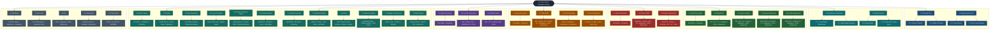

# Work Breakdown Structure Diagram

**Version:** 2.2.0  
**Created:** 2026-09-24  
**Last Updated:** 2026-11-25

```mermaid
%%{init: {"flowchart": {"htmlLabels": true, "curve": "basis", "nodeSpacing": 20, "rankSpacing": 28}}}%%
flowchart TB
    root(["0. Task & Project Management App"])

    subgraph docs["1. Project Documentation"]
        d1["1.1 Planning Docs"]
        d2["1.2 Requirements Docs"]
        d1 --> d11["1.1.1 Project Proposal"]
        d1 --> d12["1.1.2 WBS & Timeline"]
        d2 --> d21["1.2.1 User Stories"]
        d2 --> d22["1.2.2 Use-Case Diagram"]
    end

    subgraph design["2. UI/UX Design"]
        u1["2.1 Wireframes & Mockups"]
        u2["2.2 Design System"]
        u1 --> u11["2.1.1 Low-Fidelity Wireframes"]
        u1 --> u12["2.1.2 High-Fidelity Mockups"]
        u2 --> u21["2.2.1 Style Guide"]
        u2 --> u22["2.2.2 Responsive Layout Specs"]
    end

    subgraph auth["3. User Authentication"]
        a0["3.1 Sprint Documents"]
        a1["3.2 Registration"]
        a2["3.3 Login & Session"]
        a3["3.4 Password Recovery"]
        a4["3.5 Profile Management"]
        a0 --> ad["Test Matrix + Ceremony"]
        a1 --> ac["DB + API + UI + Integration + E2E + Regression"]
        a2 --> al["DB + API + UI + Session + Integration + E2E + Regression"]
        a3 --> ar["Reset Table + Email API + UI + Integration + E2E + Regression"]
        a4 --> ap["Profile API + Settings UI + Integration + E2E + Regression"]
    end

    subgraph projects["4. Project Management"]
        p0["4.1 Sprint Documents"]
        p1["4.2 Project CRUD"]
        p2["4.3 Project Organization"]
        p0 --> pd["Test Matrix + Ceremony"]
        p1 --> pc["Migration + Seeds + API + UI + Integration + E2E + Regression"]
        p2 --> po["Favorites + Archive + Ordering + API + UI + Tests"]
    end

    subgraph tasks["5. Task Management"]
        t0["5.1 Sprint Documents"]
        t1["5.2 Task CRUD"]
        t2["5.3 Task Scheduling"]
        t3["5.4 Task Organization"]
        t0 --> td["Test Matrix + Ceremony"]
        t1 --> tc["DB + Seeds + API + CRUD UI + Integration + E2E + Regression"]
        t2 --> ts["Dates + Deadlines + Recurrence + Reminders"]
        t3 --> to["Priorities + Labels + Task-Label Links"]
    end

    subgraph dashboard["6. Dashboard & Reporting"]
        h0["6.1 Sprint Documents"]
        h1["6.2 Current & Upcoming"]
        h2["6.3 Overdue Tasks"]
        h0 --> hd["Test Matrix + Ceremony"]
        h1 --> hc["DB + Seeds + API + Dashboard UI + Tests"]
        h2 --> ho["DB + API + Overdue View + Tests"]
    end

    subgraph sprint5["7. Filtering, Archive, Settings & Search"]
        s0["7.1 Sprint Documents"]
        s1["7.2 Sorting & Filtering"]
        s2["7.3 Archive"]
        s3["7.4 Labels & Priorities"]
        s4["7.5 Settings & Preferences"]
        s5["7.6 Global Search"]
        s0 --> sd["Test Matrix + API Spec + Ceremony"]
        s1 --> sf["Indexes + Filters + URL State + Sort Menu"]
        s2 --> sa["Task, Project & Label Archive + Restore + Delete"]
        s3 --> sl["Custom Priorities + Ordered Labels + Task Counts"]
        s4 --> ss["Limits + Font + Theme + Widgets"]
        s5 --> sg["Trigram Search + Search API + Results UI"]
    end

    subgraph sprint6["8. Sprint 6–6.6 Enhancements"]
        x0["8.1 Sprint 6 Views"]
        x1["8.2 Streaks"]
        x2["8.3 Task Reordering"]
        x3["8.4 Home & Kanban"]
        x4["8.5 Search, Archive & Theme"]
        x5["8.6 Timeline (Gantt)"]
        x0 --> x01["API Spec + Test Matrix + Ceremony"]
        x1 --> x11["Streak Series + Streak Page + Dashboard"]
        x2 --> x21["List, Board & Project Position Reordering"]
        x3 --> x31["Home Tasks Tab + Kanban Board"]
        x4 --> x41["Global Search + Archive E2E + Theme Preference"]
        x5 --> x51["Gantt API + Day Bars + Zoom + Drag Dates"]
    end

    subgraph infra["9. Infrastructure, QA & Delivery"]
        i1["9.1 Database"]
        i2["9.2 API Layer"]
        i3["9.3 QA"]
        i4["9.4 Deployment"]
        i5["9.5 Presentation"]
        i1 --> i11["Schema Design + Migrations + Supabase"]
        i2 --> i21["API Specifications + Integration Tests"]
        i3 --> i31["Unit + Integration + E2E + Regression"]
        i4 --> i41["Hosted Frontend + Backend + Repository"]
        i5 --> i51["Slides + Live Demo + README"]
    end

    root --> d1
    root --> u1
    root --> a1
    root --> p1
    root --> t1
    root --> h1
    root --> s1
    root --> x1
    root --> i1

    classDef root fill:#202938,color:#FFFFFF,stroke:#111827,stroke-width:2px
    classDef docs fill:#1F4E79,color:#FFFFFF,stroke:#163A5B
    classDef design fill:#0F6B70,color:#FFFFFF,stroke:#0A4D51
    classDef auth fill:#22623A,color:#FFFFFF,stroke:#18492A
    classDef projects fill:#9B2C2C,color:#FFFFFF,stroke:#762020
    classDef tasks fill:#9A4D00,color:#FFFFFF,stroke:#753A00
    classDef dashboard fill:#563C88,color:#FFFFFF,stroke:#3E2A65
    classDef enhance fill:#176B62,color:#FFFFFF,stroke:#105047
    classDef infra fill:#425466,color:#FFFFFF,stroke:#2E3A48

    class root root
    class d1,d2,d11,d12,d21,d22 docs
    class u1,u2,u11,u12,u21,u22 design
    class a0,a1,a2,a3,a4,ad,ac,al,ar,ap auth
    class p0,p1,p2,pd,pc,po projects
    class t0,t1,t2,t3,td,tc,ts,to tasks
    class h0,h1,h2,hd,hc,ho dashboard
    class s0,s1,s2,s3,s4,s5,sd,sf,sa,sl,ss,sg enhance
    class x0,x1,x2,x3,x4,x5,x01,x11,x21,x31,x41,x51 enhance
    class i1,i2,i3,i4,i5,i11,i21,i31,i41,i51 infra
```
